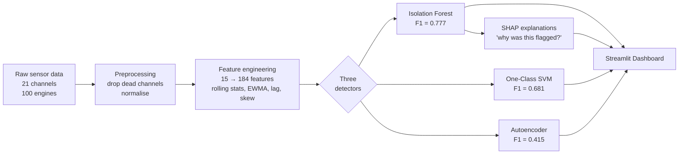
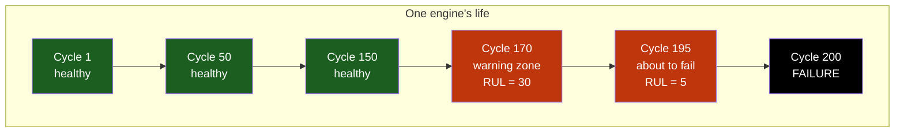
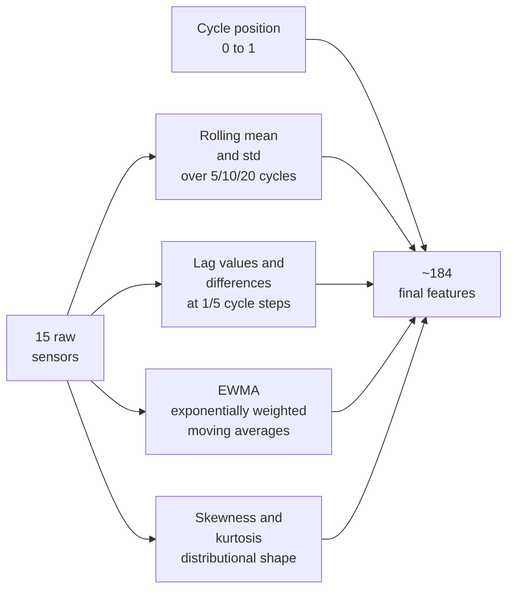
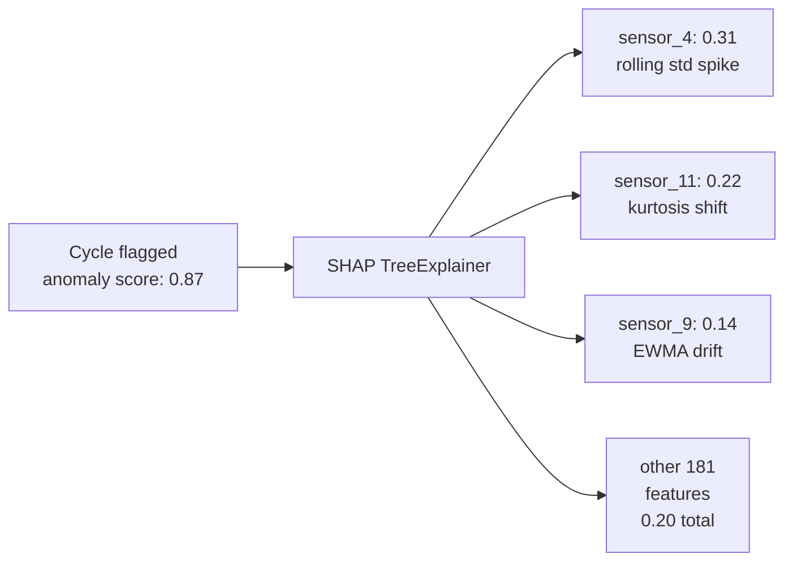

# Industrial Sensor Anomaly Detection Dashboard

[](https://sensor-anomaly-detection-aj.streamlit.app/)
[](https://www.python.org/)
[](LICENSE)
[](tests/)

> **[Try the live dashboard →](https://sensor-anomaly-detection-aj.streamlit.app/)**

---

## In plain English

Jet engines are expensive. When one fails unexpectedly, the cost is enormous — a grounded aircraft, an emergency repair, sometimes a safety incident. The goal of *predictive maintenance* is to spot the warning signs early, while the engine is still in service, so it can be pulled for inspection on the operator's schedule rather than the engine's.

This project takes sensor recordings from **100 simulated jet engines** (NASA's C-MAPSS dataset) and builds three different "watchdog" models that learn what a *healthy* engine looks like — temperature, pressure, fuel flow, fan speed, and so on. Once trained, each watchdog raises an alarm when readings start drifting away from healthy patterns, which usually happens **30+ cycles before failure**.

You can play with all three models live in the dashboard — pick an engine, pick a model, watch the anomaly score climb as the engine degrades, and (for the best-performing model) ask *why* a given moment was flagged.

---

## How it all fits together



Each block is a small, testable module. The dashboard is what a maintenance engineer would actually use day-to-day.

---

## What the results look like

All three models are trained on *healthy* engine data only. They never see failures during training — so the alarm they raise on degraded readings is a true "this doesn't look normal" signal, not a memorised pattern.

| Model | F1 | AUC-ROC | Precision | Recall |
|-------|-----|---------|-----------|--------|
| **Isolation Forest** | **0.777** | **0.957** | 0.734 | 0.826 |
| One-Class SVM | 0.681 | 0.926 | 0.609 | 0.773 |
| Autoencoder | 0.415 | 0.766 | 0.362 | 0.485 |

*Evaluated on a held-out set of 20 engines (4,291 sensor readings, 14.4% labelled anomalous).*

**Reading the numbers:** F1 balances *precision* (when the model says "alarm", how often is it right?) and *recall* (of all the real problems, how many does it catch?). 0.777 means the Isolation Forest catches ~83% of degrading engines while only ~27% of its alarms are false. AUC-ROC of 0.957 means the model is very good at *ranking* — i.e. the worst engines almost always score higher than the healthy ones.

---

## The dataset, in two minutes

**NASA C-MAPSS** is a simulation of turbofan jet engines that NASA released for public research. Each engine starts perfectly healthy, runs for a few hundred operating cycles, and gradually degrades until it fails. Throughout its life, **21 sensors** record physical measurements at each cycle.



We label everything in the last **30 cycles before failure** as "anomalous". This is the *Remaining Useful Life (RUL) ≤ 30* window — the maintenance team's intervention zone. Earlier cycles are "healthy" and used for training.

| Property | Value |
|----------|-------|
| Engines | 100 (80 train / 20 test) |
| Sensor channels | 21 (6 are dead — flat readings, dropped — leaving 15 useful ones) |
| Operating settings | 3 |
| Total samples | 20,631 |
| Anomaly rate | ~15% |

*Source: [NASA Prognostics Data Repository](https://data.nasa.gov/dataset/cmapss-jet-engine-simulated-data). Reference: Saxena et al., "Damage Propagation Modeling for Aircraft Engine Run-to-Failure Simulation", PHM08.*

---

## How the pipeline works, step by step

### Step 1 — Cleaning

- **Drop 6 dead sensors.** Six of the 21 channels never change across the entire dataset — they carry no signal. Removing them simplifies the model without losing information.
- **Normalise.** Sensor values live on wildly different scales (temperatures in hundreds, pressures in single digits). Standardisation puts them all on a common footing so a single model can compare them.
- **Split by engine, not by row.** A naive split would put cycles from the same engine into both training and testing — the model would essentially be tested on data it had partly seen. Splitting at the engine level (80 train / 20 test) avoids this leak.
- **Train on healthy cycles only.** Anything in the RUL ≤ 30 window is held out of training. The models therefore learn one thing only: *what healthy looks like*.

### Step 2 — Feature engineering: turning 15 sensors into 184 signals

A single sensor reading at one cycle isn't very informative on its own — it's a snapshot. What matters for predictive maintenance is **how that reading is changing**. So instead of feeding the model raw values, we compute several "shapes" of recent behaviour for each sensor:



Each family captures a different kind of degradation signal:

| Family | What it captures | Why it matters |
|--------|------------------|----------------|
| **Rolling mean** | Smoothed local average | Filters out noise to reveal slow drift |
| **Rolling std** | Local volatility | Engines often get *noisier* before they get *off-center* |
| **EWMA** | Recent-weighted average | Reacts faster than a plain rolling mean to fresh changes |
| **Lag & difference** | Value `k` cycles ago, and the change since then | Captures rate-of-change and sudden jumps |
| **Skewness** | Asymmetry of recent readings | Healthy readings are symmetric; degrading ones often skew |
| **Kurtosis** | "Tailedness" — frequency of extreme readings | Spikes and outliers appear before mean drift does |
| **Cycle position** | Where the engine is in its life (0 = new, 1 = end) | Pure context — degradation is more likely late in life |

Everything is computed **per engine**, so engine 1's running average never leaks into engine 2's features. See [src/feature_engineering.py](src/feature_engineering.py).

### Step 3 — Three different detectors, three different ideas of "abnormal"

Why three models? They each define "abnormal" differently, and seeing where they agree (and disagree) is more informative than any single model alone.

#### Isolation Forest — *the winner*

> *Intuition:* Imagine asking random yes/no questions about an engine's readings ("is sensor 4 above 0.3? is sensor 9's rolling std above 0.1?"). A healthy engine looks like all the other healthy engines — it takes many questions to single it out. A failing engine stands out — a handful of questions is enough.

The Isolation Forest builds 300 random decision trees and measures, for each engine reading, how quickly it gets "isolated" by random splits. Short isolation paths = anomaly. Best overall (F1 = 0.777), works natively on all 184 engineered features.

#### One-Class SVM — *strong runner-up*

> *Intuition:* Draw a flexible bubble around all the healthy readings in feature space. Anything inside the bubble is normal; anything outside is suspicious.

The bubble shape is learned by an RBF kernel, which lets the boundary curve in non-obvious ways. Slower than Isolation Forest (memory grows with the square of training size, so we subsample to 10,000 healthy points), but a useful sanity check.

#### Autoencoder — *the complementary approach*

> *Intuition:* Train a small neural network to copy healthy sensor readings to itself, going through a narrow bottleneck. When the bottleneck is forced to compress the input, the network learns to reproduce *typical* patterns. Feed it degraded readings and it can't reproduce them accurately — the size of that reproduction error is the anomaly score.

```text
Input (15 sensors) → 32 → 16 → 8 (bottleneck) → 16 → 32 → Output (15 sensors)
```

**Important design choice:** the autoencoder is trained on **15 raw sensors only**, not the 184 engineered features. Autoencoders learn by reconstructing inputs — when many inputs are highly correlated (e.g. rolling mean of sensor 2 vs EWMA of sensor 2), reconstruction error becomes noisy and uninformative. Raw sensors give a cleaner signal.

**Why it underperforms here:** a standard autoencoder treats each cycle independently — it doesn't know what came before. C-MAPSS degradation is a *gradual* shift over many cycles, which is exactly what sequence models (LSTMs, Transformers) are built for. Replacing the feedforward with an LSTM-based autoencoder on sliding windows is a natural next step.

### Step 4 — Choosing the alarm threshold

Each model produces a continuous "anomaly score" per cycle — but the dashboard needs a *yes/no* alarm. Rather than using each library's default cutoff, the threshold is chosen by sweeping all possible cutoffs and picking the one that **maximises F1** on a validation set. This matters when only ~15% of the data is anomalous — at that imbalance, a "never alarm" model would still be 85% accurate but useless.

### Step 5 — Explaining the alarm: SHAP

When the dashboard flags a cycle as anomalous, the obvious next question is **"why?"** — which sensor is misbehaving, and what kind of misbehaviour is it (a sudden jump? rising volatility? a distributional shift?).

[SHAP](https://shap.readthedocs.io/) (Shapley Additive Explanations) borrows an idea from cooperative game theory to fairly attribute the model's score to its input features. The pipeline includes:

- A **`TreeExplainer`** that computes *exact* attributions from the Isolation Forest's tree structure — fast and deterministic, no Monte Carlo sampling.
- A **sign convention** designed for humans: positive bars push a sample *towards anomalous*, negative bars pull it *back to healthy*.
- **Two aggregations for display**, because raw 184-bar plots are unreadable:
  - **Per base sensor** — rolls up `sensor_4_*` (all rolling stats, lags, EWMAs, etc. of sensor 4) into a single bar. Answers *which sensor is misbehaving*.
  - **Per feature family** — sums across rolling-mean / rolling-std / EWMA / lag / diff / skew / kurt. Answers *what kind of anomaly* this is.
- A **per-cycle drill-down**: pick any cycle in the engine's life and see the top contributors for just that moment.



SHAP attributions are **model-specific** — they explain the chosen detector, not the underlying data. Running SHAP on the One-Class SVM (`KernelExplainer`) and Autoencoder (`DeepExplainer`) would yield distinct, complementary stories — and *agreement* between models on both prediction *and* top features is a stronger anomaly signal than majority voting alone. That multi-model comparison is tracked as future work; the current panel covers the best-performing detector (Isolation Forest) to keep the deployed explanation coherent and fast.

---

## What's in the project

```
sensor-anomaly-detection/
├── app/
│   └── streamlit_app.py          # Interactive dashboard
├── data/
│   └── *.txt                     # C-MAPSS sensor recordings
├── models/
│   ├── isolation_forest.pkl      # Trained models, ready to load
│   ├── autoencoder.pt
│   └── one_class_svm.pkl
├── notebooks/
│   ├── 01_eda.ipynb              # Walk through the data
│   ├── 02_feature_engineering.ipynb
│   └── 03_model_comparison.ipynb # Training, evaluation, PR curves
├── src/
│   ├── data_loader.py            # C-MAPSS ingestion & RUL labelling
│   ├── preprocessing.py          # Normalisation, splitting, cleaning
│   ├── feature_engineering.py    # Rolling, lag, EWMA, statistical features
│   ├── evaluation.py             # Precision, Recall, F1, AUC-PR, AUC-ROC
│   ├── explainability.py         # SHAP attributions for Isolation Forest
│   └── models/
│       ├── isolation_forest.py
│       ├── autoencoder.py
│       └── one_class_svm.py
├── tests/                        # 12 unit tests, all passing
├── Dockerfile
├── requirements.txt
└── README.md
```

---

## Try it yourself

### 1. Clone and set up

```bash
git clone https://github.com/Anjanamb/sensor-anomaly-detection.git
cd sensor-anomaly-detection

python -m venv venv
source venv/bin/activate      # Linux / macOS
# venv\Scripts\activate       # Windows

pip install -r requirements.txt
```

### 2. Open the notebooks (optional, walks through the reasoning)

```bash
jupyter notebook notebooks/
```

Run in order: `01_eda.ipynb` → `02_feature_engineering.ipynb` → `03_model_comparison.ipynb`.

### 3. Launch the dashboard

```bash
streamlit run app/streamlit_app.py
```

Open the printed URL (usually `http://localhost:8501`), pick an engine, watch its anomaly score evolve cycle by cycle, and toggle the SHAP panel to see why specific cycles were flagged.

### 4. Run the test suite

```bash
pytest tests/ -v
```

---

## Limitations & next steps

- **Feedforward autoencoder ignores time.** Each cycle is scored independently. Replacing the network with an LSTM or Temporal Convolutional autoencoder on sliding windows would let it learn *sequential* degradation patterns — likely the biggest single uplift available.
- **Single operating condition (FD001).** This is the easiest of four C-MAPSS subsets. FD002–FD004 add multiple operating conditions and fault modes, which would stress-test generalisation.
- **Binary anomaly label.** Cycles are labelled anomalous or not based on a hard RUL ≤ 30 cutoff. Predicting RUL directly (as a regression) would give a smoother, more actionable signal.
- **No online learning.** Models are trained once and frozen. A real deployment would need to update them as new flight data arrives.
- **Single-model SHAP.** SHAP attributions are currently produced only for the Isolation Forest. Adding `KernelExplainer` (One-Class SVM) and `DeepExplainer` (Autoencoder) would unlock cross-model attribution comparison.

---

## Tech stack

| Category | Tools |
|----------|-------|
| **ML / Data** | Python, PyTorch, scikit-learn, pandas, NumPy, SciPy |
| **Explainability** | SHAP |
| **Visualisation** | Plotly, Matplotlib, Seaborn |
| **Dashboard** | Streamlit |
| **Testing** | pytest |
| **Deployment** | Docker, Streamlit Cloud |

---

## Docker

```bash
docker build -t sensor-anomaly .
docker run -p 8501:8501 sensor-anomaly
```

Then open `http://localhost:8501`.

---

## Author

**Anjana Bandara**
MSc Artificial Intelligence & Data Science — Heinrich Heine University Düsseldorf

[](https://linkedin.com/in/anjana-b-)
[](https://github.com/Anjanamb)

---

## License

MIT — see [LICENSE](LICENSE).
