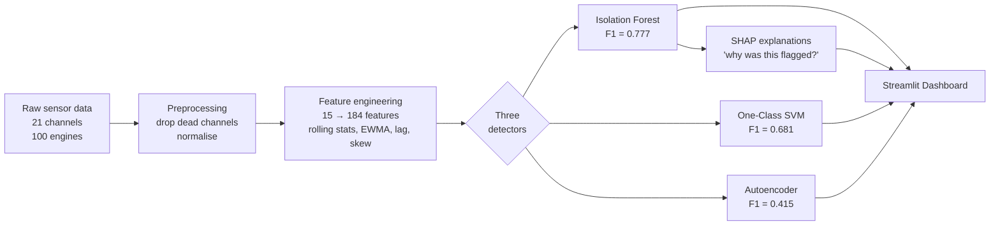
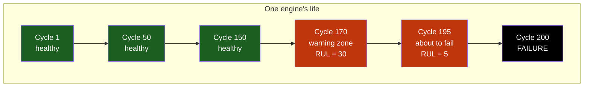
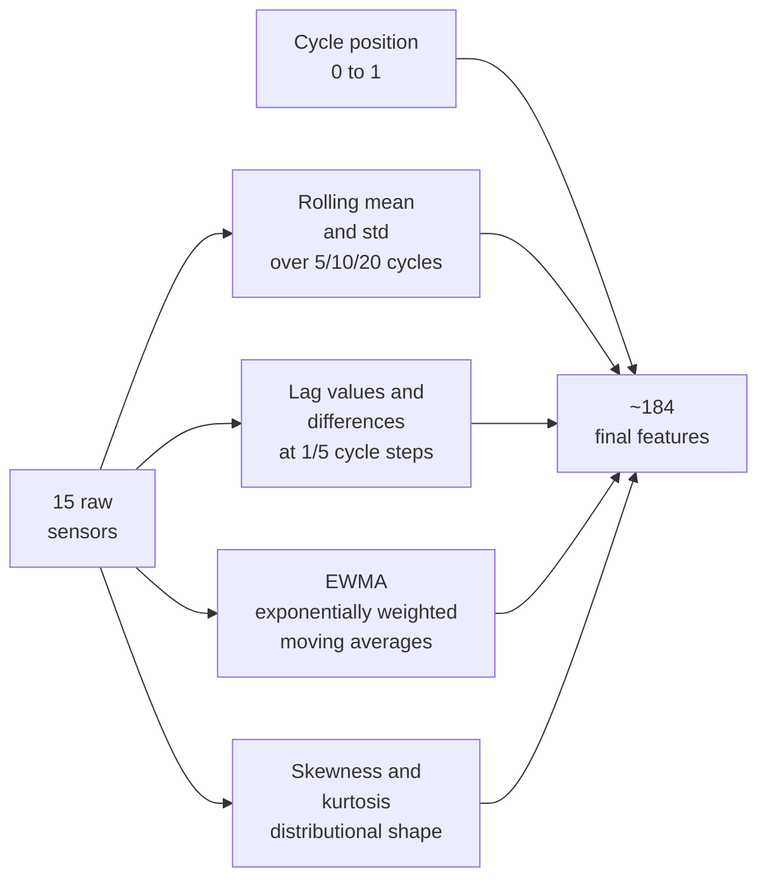
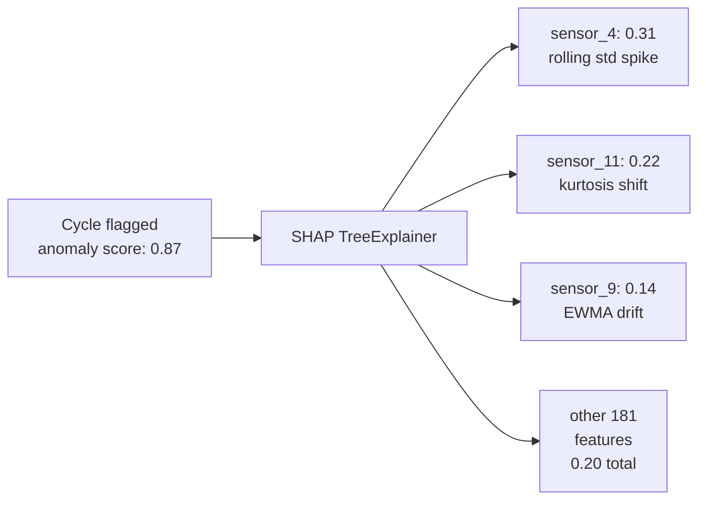

# Industrial Sensor Anomaly Detection Dashboard

[](https://sensor-anomaly-detection-aj.streamlit.app/)
[](https://www.python.org/)
[](LICENSE)
[](tests/)

> **[Try the live dashboard →](https://sensor-anomaly-detection-aj.streamlit.app/)**  ·  **[Read the journey doc — decisions, challenges, lessons (5 min)](JOURNEY.md)**

---

## In plain English

Jet engines are expensive. When one fails unexpectedly, the cost is enormous — a grounded aircraft, an emergency repair, sometimes a safety incident. The goal of *predictive maintenance* is to spot the warning signs early, while the engine is still in service, so it can be pulled for inspection on the operator's schedule rather than the engine's.

This project takes sensor recordings from **100 simulated jet engines** (NASA's C-MAPSS dataset) and builds three different "watchdog" models that learn what a *healthy* engine looks like — temperature, pressure, fuel flow, fan speed, and so on. Once trained, each watchdog raises an alarm when readings start drifting away from healthy patterns, which usually happens **30+ cycles before failure**.

You can play with all three models live in the dashboard — pick an engine, pick a model, watch the anomaly score climb as the engine degrades, and (for the best-performing model) ask *why* a given moment was flagged.

---

## How it all fits together



Each block is a small, testable module. The dashboard is what a maintenance engineer would actually use day-to-day.

---

## What the results look like

All five detectors are trained on *healthy* engine data only. They never see failures during training — so the alarm they raise on degraded readings is a true "this doesn't look normal" signal, not a memorised pattern.

| Model | F1 | AUC-ROC | AUC-PR | Precision | Recall |
|-------|-----|---------|--------|-----------|--------|
| **Isolation Forest** | **0.777** | **0.957** | **0.701** | 0.734 | 0.826 |
| One-Class SVM | 0.681 | 0.926 | 0.650 | 0.609 | 0.773 |
| Autoencoder (feedforward) | 0.465 | 0.799 | 0.457 | 0.399 | 0.558 |
| Transformer Autoencoder | 0.439 | 0.762 | **0.518** | 0.454 | 0.424 |
| LSTM Autoencoder | 0.416 | 0.674 | 0.239 | 0.311 | 0.627 |

*Evaluated on a held-out set of 20 engines (4,291 cycles for IF / SVM / feedforward AE; 3,691 windows for the sequence models since the first 29 cycles of each engine drop out). The Isolation Forest and One-Class SVM are deterministic (seeded); the three autoencoders are not seeded across PyTorch's stochastic layers, so their numbers can shift by ±1–2 F1 points on a retrain. None of the deep models are the headline detector — see "Sequence models on C-MAPSS" below for what they actually prove.*

**Reading the numbers:** F1 balances *precision* (when the model says "alarm", how often is it right?) and *recall* (of all the real problems, how many does it catch?). 0.777 means the Isolation Forest catches ~83% of degrading engines while only ~27% of its alarms are false. AUC-ROC of 0.957 means the model is very good at *ranking* — the worst engines almost always score higher than the healthy ones. **AUC-PR** is the same idea but tailored for imbalanced data and is the cleanest threshold-free metric here — on AUC-PR the **Transformer leads all deep models (0.518)**, even though the feedforward AE happened to win the F1 race this run (run-to-run variance from unseeded training).

---

## The dataset, in two minutes

**NASA C-MAPSS** is a simulation of turbofan jet engines that NASA released for public research. Each engine starts perfectly healthy, runs for a few hundred operating cycles, and gradually degrades until it fails. Throughout its life, **21 sensors** record physical measurements at each cycle.



We label everything in the last **30 cycles before failure** as "anomalous". This is the *Remaining Useful Life (RUL) ≤ 30* window — the maintenance team's intervention zone. Earlier cycles are "healthy" and used for training.

| Property | Value |
|----------|-------|
| Engines | 100 (80 train / 20 test) |
| Sensor channels | 21 (6 are dead — flat readings, dropped — leaving 15 useful ones) |
| Operating settings | 3 |
| Total samples | 20,631 |
| Anomaly rate | ~15% |

*Source: [NASA Prognostics Data Repository](https://data.nasa.gov/dataset/cmapss-jet-engine-simulated-data). Reference: Saxena et al., "Damage Propagation Modeling for Aircraft Engine Run-to-Failure Simulation", PHM08.*

---

## How the pipeline works, step by step

### Step 1 — Cleaning

- **Drop 6 dead sensors.** Six of the 21 channels never change across the entire dataset — they carry no signal. Removing them simplifies the model without losing information.
- **Normalise.** Sensor values live on wildly different scales (temperatures in hundreds, pressures in single digits). Standardisation puts them all on a common footing so a single model can compare them.
- **Split by engine, not by row.** A naive split would put cycles from the same engine into both training and testing — the model would essentially be tested on data it had partly seen. Splitting at the engine level (80 train / 20 test) avoids this leak.
- **Train on healthy cycles only.** Anything in the RUL ≤ 30 window is held out of training. The models therefore learn one thing only: *what healthy looks like*.

### Step 2 — Feature engineering: turning 15 sensors into 184 signals

A single sensor reading at one cycle isn't very informative on its own — it's a snapshot. What matters for predictive maintenance is **how that reading is changing**. So instead of feeding the model raw values, we compute several "shapes" of recent behaviour for each sensor:



Each family captures a different kind of degradation signal:

| Family | What it captures | Why it matters |
|--------|------------------|----------------|
| **Rolling mean** | Smoothed local average | Filters out noise to reveal slow drift |
| **Rolling std** | Local volatility | Engines often get *noisier* before they get *off-center* |
| **EWMA** | Recent-weighted average | Reacts faster than a plain rolling mean to fresh changes |
| **Lag & difference** | Value `k` cycles ago, and the change since then | Captures rate-of-change and sudden jumps |
| **Skewness** | Asymmetry of recent readings | Healthy readings are symmetric; degrading ones often skew |
| **Kurtosis** | "Tailedness" — frequency of extreme readings | Spikes and outliers appear before mean drift does |
| **Cycle position** | Where the engine is in its life (0 = new, 1 = end) | Pure context — degradation is more likely late in life |

Everything is computed **per engine**, so engine 1's running average never leaks into engine 2's features. See [src/feature_engineering.py](src/feature_engineering.py).

### Step 3 — Three different detectors, three different ideas of "abnormal"

Why three models? They each define "abnormal" differently, and seeing where they agree (and disagree) is more informative than any single model alone.

#### Isolation Forest — *the winner*

> *Intuition:* Imagine asking random yes/no questions about an engine's readings ("is sensor 4 above 0.3? is sensor 9's rolling std above 0.1?"). A healthy engine looks like all the other healthy engines — it takes many questions to single it out. A failing engine stands out — a handful of questions is enough.

The Isolation Forest builds 300 random decision trees and measures, for each engine reading, how quickly it gets "isolated" by random splits. Short isolation paths = anomaly. Best overall (F1 = 0.777), works natively on all 184 engineered features.

#### One-Class SVM — *strong runner-up*

> *Intuition:* Draw a flexible bubble around all the healthy readings in feature space. Anything inside the bubble is normal; anything outside is suspicious.

The bubble shape is learned by an RBF kernel, which lets the boundary curve in non-obvious ways. Slower than Isolation Forest (memory grows with the square of training size, so we subsample to 10,000 healthy points), but a useful sanity check.

#### Autoencoder — *the complementary approach*

> *Intuition:* Train a small neural network to copy healthy sensor readings to itself, going through a narrow bottleneck. When the bottleneck is forced to compress the input, the network learns to reproduce *typical* patterns. Feed it degraded readings and it can't reproduce them accurately — the size of that reproduction error is the anomaly score.

```text
Input (15 sensors) → 32 → 16 → 8 (bottleneck) → 16 → 32 → Output (15 sensors)
```

**Important design choice:** the autoencoder is trained on **15 raw sensors only**, not the 184 engineered features. Autoencoders learn by reconstructing inputs — when many inputs are highly correlated (e.g. rolling mean of sensor 2 vs EWMA of sensor 2), reconstruction error becomes noisy and uninformative. Raw sensors give a cleaner signal.

**Why it underperforms here:** a standard autoencoder treats each cycle independently — it doesn't know what came before. C-MAPSS degradation is a *gradual* shift over many cycles, which is exactly what sequence models are built for. The next detector addresses this directly.

#### LSTM Autoencoder — *the time-aware addition*

> *Intuition:* Same idea as the feedforward AE — train a network to copy healthy windows to themselves — but now the input is **30 consecutive cycles** instead of a single cycle. The encoder is a 2-layer LSTM that sees the cycles in order; the bottleneck is 8-dimensional; the decoder is another LSTM that unrolls back to 30 cycles. Reconstruction error couples across the window, so a gradual drift over many cycles is something the model can actually learn to recognise.

```text
Input (30 × 15) → LSTM-encoder → 8 (bottleneck) → LSTM-decoder → Output (30 × 15)
```

**The honest result:** on FD001 the LSTM AE lands at F1 ≈ 0.42 — close to the feedforward AE, not a dramatic win. FD001 only has one operating condition and one fault mode, so cycle-level marginal distributions already carry most of the signal; a sequence model has limited room to add value. The LSTM also trains poorly — the "repeat the bottleneck across T steps" decoder is a weak design, and reconstruction loss barely moved over 80 epochs (~0.29 → 0.26).

#### Transformer Autoencoder — *a stronger sequence model*

> *Intuition:* Same windowed setup as the LSTM AE, but the encoder is a **self-attention** stack instead of an LSTM. Every cycle attends to every other cycle directly through learned attention weights, with a learned positional embedding so the model knows which cycle is which. A per-timestep bottleneck (8 dimensions, smaller than the 15 raw sensors) forces real compression.

```text
Input (30 × 15) → Linear(15→64) + pos → TransformerEncoder ×2
                                       → Linear(64→8)  [bottleneck per cycle]
                                       → Linear(8→64) + pos → TransformerEncoder ×2
                                       → Linear(64→15) → Output (30 × 15)
```

**Why it's the stronger deep model:** reconstruction loss converged to ~0.035 — an order of magnitude lower than the LSTM's ~0.26 — meaning attention actually *learned* the healthy temporal structure rather than averaging it out. On the threshold-free **AUC-PR** metric it leads every other autoencoder (0.518 vs feedforward 0.457 vs LSTM 0.239). On F1 it's roughly tied with the feedforward AE because the AE numbers are noisy run-to-run (unseeded training).

#### Do the sequence models actually use cycle order?

This is the real test, and the headline of [notebooks/04_lstm_temporal.ipynb](notebooks/04_lstm_temporal.ipynb):

> Take the test windows and **shuffle the 30 cycles inside each window** (independently per window). The marginal distribution of every sensor is unchanged — only the order is destroyed.
>
> | Model | F1 (ordered) | F1 (permuted) | AUC-ROC (ordered) | AUC-ROC (permuted) |
> |---|---|---|---|---|
> | Feedforward AE (per-window mean) | 0.592 | **0.592** | 0.855 | **0.855** |
> | LSTM AE | 0.416 | 0.498 | 0.674 | 0.843 |
> | Transformer AE | 0.439 | 0.500 | 0.762 | 0.810 |

A model that ignores time produces identical scores on ordered and permuted inputs — which is exactly what the feedforward AE does (to three decimal places). The LSTM and Transformer both shift visibly, proving they're genuinely order-sensitive. That's the architectural property we wanted to demonstrate; the absolute F1 gap to the IF is secondary on FD001 and would widen on FD002–FD004 (multiple operating conditions, multiple fault modes).

### Step 4 — Choosing the alarm threshold

Each model produces a continuous "anomaly score" per cycle — but the dashboard needs a *yes/no* alarm. Rather than using each library's default cutoff, the threshold is chosen by sweeping all possible cutoffs and picking the one that **maximises F1** on a validation set. This matters when only ~15% of the data is anomalous — at that imbalance, a "never alarm" model would still be 85% accurate but useless.

### Step 5 — Explaining the alarm: SHAP

When the dashboard flags a cycle as anomalous, the obvious next question is **"why?"** — which sensor is misbehaving, and what kind of misbehaviour is it (a sudden jump? rising volatility? a distributional shift?).

[SHAP](https://shap.readthedocs.io/) (Shapley Additive Explanations) borrows an idea from cooperative game theory to fairly attribute the model's score to its input features. The pipeline includes:

- A **`TreeExplainer`** that computes *exact* attributions from the Isolation Forest's tree structure — fast and deterministic, no Monte Carlo sampling.
- A **sign convention** designed for humans: positive bars push a sample *towards anomalous*, negative bars pull it *back to healthy*.
- **Two aggregations for display**, because raw 184-bar plots are unreadable:
  - **Per base sensor** — rolls up `sensor_4_*` (all rolling stats, lags, EWMAs, etc. of sensor 4) into a single bar. Answers *which sensor is misbehaving*.
  - **Per feature family** — sums across rolling-mean / rolling-std / EWMA / lag / diff / skew / kurt. Answers *what kind of anomaly* this is.
- A **per-cycle drill-down**: pick any cycle in the engine's life and see the top contributors for just that moment.



#### Plain-English layer (the "what does this name mean?" problem)

Raw SHAP feature names — `sensor_9_diff_5`, `sensor_14_roll_std_10` — are precise but unreadable to anyone outside the project. The dashboard layers three views on top of the same SHAP values:

1. **Raw feature name** — what's actually in the model.
2. **Pretty label** — a human-readable version via `pretty_feature_label()`.
3. **One-sentence narrative** — a summary across the top contributors via `narrate()`.

| Stage | Example for engine 5, final cycle |
|---|---|
| 1. Raw feature | `sensor_9_diff_5` — top SHAP value 0.31 |
| 2. Pretty label | "Sensor 9 — change over 5 cycles" |
| 3. Narrative | *"Flagged because **Sensor 14** is drifting from its baseline and **Sensor 9** is trending away from healthy recently."* |

The model produces the same numbers at every stage; only the **presentation** changes. The dashboard surfaces all three: pretty labels on the per-cycle SHAP chart, the narrative as a banner above it, and a `feature_glossary()` table in a collapsible expander for users who want the full mapping. Walkthrough lives in [notebooks/05_shap_narratives.ipynb](notebooks/05_shap_narratives.ipynb).

#### Scope and limitations

SHAP attributions are **model-specific** — they explain the chosen detector, not the underlying data. Running SHAP on the One-Class SVM (`KernelExplainer`) and Autoencoder (`DeepExplainer`) would yield distinct, complementary stories — and *agreement* between models on both prediction *and* top features is a stronger anomaly signal than majority voting alone. That multi-model comparison is tracked as future work; the current panel covers the best-performing detector (Isolation Forest) to keep the deployed explanation coherent and fast.

The narrative describes *what's pushing the model's score upward*, regardless of whether that score actually crossed the alarm threshold. It answers "what is the model paying attention to?" — not "is this an anomaly?". The threshold (and the Model Comparison panel) answer the latter.

---

## What's in the project

```
sensor-anomaly-detection/
├── app/
│   └── streamlit_app.py          # Interactive dashboard
├── data/
│   └── *.txt                     # C-MAPSS sensor recordings
├── models/
│   ├── FD001/                    # 5 detectors + scaler + kept_sensors.json
│   ├── FD002/                    # + kmeans.pkl + regime_scalers.pkl (multi-regime)
│   ├── FD003/                    # 5 detectors + scaler + kept_sensors.json
│   └── FD004/                    # + kmeans.pkl + regime_scalers.pkl (multi-regime)
├── notebooks/
│   ├── 01_eda.ipynb              # Walk through the data
│   ├── 02_feature_engineering.ipynb
│   ├── 03_model_comparison.ipynb # Training, evaluation, PR curves (FD001)
│   ├── 04_lstm_temporal.ipynb    # LSTM permutation demo — "does the LSTM actually use time?"
│   ├── 05_shap_narratives.ipynb  # SHAP plain-English layer — three-stage transform
│   ├── 06_fd_subset_comparison.ipynb  # Cross-subset FD001/02/03/04 — when does the ranking change?
│   └── 07_feature_importance.ipynb    # Global SHAP, sensor → physical meaning, lifecycle pattern
├── bi/
│   ├── build_data.py             # Generates the 5 CSVs Power BI consumes
│   ├── data/                     # Committed Power BI consumer CSVs (regen via build_data.py)
│   ├── BUILD_GUIDE.md            # Step-by-step Power BI Desktop assembly guide
│   ├── dashboard.pbix            # Power BI dashboard (committed after manual assembly)
│   └── screenshots/              # Page screenshots for the README
├── scripts/
│   └── train_subsets.py          # Train + save per-subset artefacts under models/<SUBSET>/
├── src/
│   ├── data_loader.py            # C-MAPSS ingestion & RUL labelling
│   ├── preprocessing.py          # Normalisation, splitting, cleaning
│   ├── feature_engineering.py    # Rolling, lag, EWMA, statistical features
│   ├── multi_regime.py           # Per-regime KMeans + StandardScaler for FD002/FD004
│   ├── sensor_descriptions.py    # NASA C-MAPSS sensor → physical-quantity mapping
│   ├── evaluation.py             # Precision, Recall, F1, AUC-PR, AUC-ROC
│   ├── explainability.py         # SHAP attributions for Isolation Forest
│   └── models/
│       ├── isolation_forest.py
│       ├── autoencoder.py
│       ├── lstm_autoencoder.py        # Seq2seq LSTM AE on sliding windows
│       ├── transformer_autoencoder.py # Self-attention AE on sliding windows
│       └── one_class_svm.py
├── tests/                        # 31 unit tests, all passing
├── Dockerfile
├── requirements.txt
└── README.md
```

---

## Try it yourself

### 1. Clone and set up

```bash
git clone https://github.com/Anjanamb/sensor-anomaly-detection.git
cd sensor-anomaly-detection

python -m venv venv
source venv/bin/activate      # Linux / macOS
# venv\Scripts\activate       # Windows

pip install -r requirements.txt
```

### 2. Open the notebooks (optional, walks through the reasoning)

```bash
jupyter notebook notebooks/
```

Run in order: `01_eda.ipynb` → `02_feature_engineering.ipynb` → `03_model_comparison.ipynb`.

### 3. Train the detectors (one-time, ~25 minutes)

```bash
python scripts/train_subsets.py             # all four subsets
python scripts/train_subsets.py --only FD001 # just one
```

Saved artefacts land under `models/<SUBSET>/` (5 detectors + scaler + kept-sensor list + KMeans/regime scalers for the multi-regime subsets).

### 4. Launch the dashboard

```bash
streamlit run app/streamlit_app.py
```

Open the printed URL (usually `http://localhost:8501`), pick a **C-MAPSS subset** (FD001/02/03/04), pick an engine, watch its anomaly score evolve cycle by cycle, and toggle the SHAP panel to see why specific cycles were flagged.

### 5. Run the test suite

```bash
pytest tests/ -v
```

---

## Power BI executive dashboard

The Streamlit app is the **live interactive demo**; the Power BI dashboard is the **stakeholder-style report** you'd actually share in a maintenance ops review — pre-aggregated, paginated, with KPIs up top. Same data, complementary surface.

| Page | Purpose |
|---|---|
| 1 — Executive Summary | KPI cards (engine count, anomaly rate, top model F1), model comparison bar, subset slicer |
| 2 — Engine Fleet | Scatter of `max_cycle` vs anomaly count, severity buckets, drill-through to single engine |
| 3 — Sensor Diagnostics | Top-10 sensor SHAP bar (subsystem-coloured), subsystem treemap, RUL-bucket filter |
| 4 — Single Engine Drill-Through | Anomaly-score timeline, sensor sparklines per cycle |

The dashboard consumes five CSVs generated by `python bi/build_data.py` (~12 min for all four subsets). The CSVs are committed under [bi/data/](bi/data/) so the dashboard rebuilds without re-running the model pipeline. Build instructions, data model, and DAX measures live in [bi/BUILD_GUIDE.md](bi/BUILD_GUIDE.md).

> Screenshots will land in `bi/screenshots/page_{1..4}.png` after the `.pbix` is assembled. The `.pbix` itself is downloadable from the repo for recruiters who want to open it.

---

## Feature importance findings — what the model actually pays attention to

The dashboard has a **Global Feature Importance** panel that aggregates SHAP attributions across the whole held-out test set (per subset, cached). Three findings from the FD001 analysis ([notebook 07](notebooks/07_feature_importance.ipynb)):

### 1. The top sensor is downstream of the fault, not at it

| Rank | Sensor | Subsystem | Σ \|SHAP\| |
|---|---|---|---|
| 1 | **P15** — Bypass-duct total pressure | **Fan** | 0.285 |
| 2 | NRc — Corrected core speed | Core | 0.236 |
| 3 | BPR — Bypass ratio | Performance | 0.225 |
| 4 | T50 — LPT outlet temperature | LPT | 0.224 |
| 5 | W32 — LPT coolant bleed | LPT | 0.218 |
| 6 | T30 — HPC outlet temperature | HPC | 0.212 |
| 7 | phi — Fuel-flow / Ps30 | Combustor | 0.207 |
| 8 | Ps30 — HPC outlet static pressure | HPC | 0.207 |
| 9 | NRf — Corrected fan speed | Fan | 0.205 |
| 10 | htBleed — Bleed enthalpy | HPC | 0.200 |

FD001's only fault mode is **HPC degradation**, so the obvious expectation is that the top sensor sits at the HPC. It doesn't. The single most informative feature is **P15 (bypass-duct total pressure)** in the Fan section. The model is reading HPC degradation through the *airflow redistribution* it causes: when the HPC loses efficiency, the fan/core balance shifts and bypass-duct pressure picks it up before T30 or Ps30 (the direct HPC sensors) drift much. Aggregated by subsystem, HPC still leads at 25.9% (4 sensors), with Fan a close second at 21.8% (3 sensors).

### 2. Drift beats volatility beats distribution shape — but engineered always beats raw

Feature-family ranking (share of total |SHAP|):

| Family | Share | Mean signed SHAP |
|---|---|---|
| **Rolling mean** | 19.8% | +0.180 (predominantly anomaly-pushing) |
| Rolling std | 16.6% | -0.010 (mixed direction) |
| Diff (k-cycle change) | 15.7% | -0.006 |
| Lag | 12.0% | +0.096 |
| EWMA | 10.8% | +0.110 |
| Raw sensor value | 8.6% | +0.074 |
| Kurtosis | 8.6% | -0.023 |
| Skewness | 7.9% | -0.012 |

Engineered features clearly beat raw values (raw is bottom of the pack — validating the feature-engineering work). Rolling mean is the most *directional* signal — its signed SHAP is strongly positive while the others sit near zero — which says drift features are the ones reliably pushing the model toward anomaly, while volatility / diff features push both directions depending on the engine.

### 3. The model uses different sensors at different lifecycle stages

Top sensors' |SHAP| across three RUL buckets:

| Sensor | Mid-life (RUL > 80) | Pre-warning (30 < RUL ≤ 80) | Warning zone (RUL ≤ 30) |
|---|---|---|---|
| **P15** (Fan) | **0.328** | 0.241 | **0.173** ↓ |
| NRc (Core) | 0.191 | 0.236 | **0.429** ↑ |
| BPR (Performance) | 0.190 | 0.210 | **0.398** ↑ |
| T50 (LPT) | 0.170 | 0.223 | **0.457** ↑ |
| W32 (LPT) | 0.193 | 0.200 | 0.353 |
| T30 (HPC) | 0.204 | 0.190 | 0.280 |

This is the sharpest finding. **P15 is an early indicator** — its importance drops 47% from mid-life to the warning zone (0.328 → 0.173). **T50, NRc, BPR are late indicators** — their importance rises 2–3× as failure approaches; T50 alone jumps 2.7× (0.170 → 0.457). The IF is implicitly learning a temporal progression: bypass-duct pressure drifts first; LPT temperature, core speed, and bypass ratio ramp up later. That's exactly the kind of mechanistic story SHAP attribution gives you that raw F1 numbers can't.

### Cross-subset: FD004 picks up different signals

The IF on FD004 (six operating regimes + two fault modes) reranks meaningfully. Five sensors stay in both subsets' top-10 (BPR, T50, W32, Ps30, htBleed — the robust drivers). Five drop out from FD001 (P15, NRc, T30, phi, NRf) and five new ones appear on FD004 (P30, farB, Nc, epr, Nf). Notably the **"corrected" speeds (NRc, NRf) lose ground to their physical counterparts (Nc, Nf)** on FD004 because per-regime normalisation already removes the operating-condition variance; raw RPM carries more useful information once the regime adjustment is upstream. Also, sensors that were *constant on FD001* (epr, farB) become informative on FD004 because they actually vary across the six operating regimes.

See [notebook 07](notebooks/07_feature_importance.ipynb) for the full analysis, including the side-by-side FD001 vs FD004 ranking table and the lifecycle-pattern visualisation.

---

## Cross-subset comparison (FD001 / FD002 / FD003 / FD004)

The dashboard supports all four C-MAPSS subsets via a subset selector in the sidebar. Each one trains its own copy of all 5 detectors and ships with subset-specific preprocessing artefacts (scaler, kept-sensor list, and KMeans + per-regime scalers for the multi-regime subsets).

| Subset | Operating regimes | Fault modes |
|---|---|---|
| FD001 | 1 | 1 (HPC degradation) |
| FD002 | **6** | 1 |
| FD003 | 1 | **2** (HPC + Fan) |
| FD004 | **6** | **2** |

[notebooks/06_fd_subset_comparison.ipynb](notebooks/06_fd_subset_comparison.ipynb) trains all five detectors on each subset with the same hyperparameters (multi-regime subsets get per-regime sensor normalisation via KMeans(k=6) before feature engineering). [scripts/train_subsets.py](scripts/train_subsets.py) is the production version that persists the artefacts under `models/<SUBSET>/` for the dashboard to load. ~15–25 minutes end-to-end on a mid-range desktop GPU. F1 results:

| Model | FD001 | FD002 | FD003 | FD004 |
|---|---|---|---|---|
| **Isolation Forest** | **0.777** | **0.830** | 0.665 | **0.762** |
| One-Class SVM | 0.681 | 0.732 | 0.670 | 0.737 |
| Transformer AE | 0.489 | 0.654 | 0.592 | 0.711 |
| LSTM AE | 0.356 | 0.702 | 0.486 | 0.714 |
| Autoencoder (feedforward) | 0.468 | 0.542 | **0.686** | 0.562 |

Three findings worth carrying:

1. **The IF wins 3 of 4 subsets but loses FD003 to the feedforward Autoencoder** (0.665 vs 0.686). Mechanism: reconstruction-error AEs flag *any* deviation from healthy, so two fault modes (HPC + Fan) light up uniformly; the IF's tree splits need to carve two separate anomaly regions and with only ~100 train engines the splits are noisier.
2. **Sequence models specifically benefit from multi-regime data.** The Transformer's gap to the IF shrinks from -0.29 (FD001) to -0.05 (FD004); the LSTM closes from -0.42 to -0.05. On FD003 (single regime, multi-fault) sequence models *don't* improve much — multi-fault alone doesn't need attention over time.
3. **The One-Class SVM is the dark-horse all-rounder.** Stays within ~0.1 F1 of the IF across every subset and beats it on FD003. The kernel boundary generalises consistently.

The headline shifts from "*IF dominates*" (FD001-only view) to "*the right detector depends on which kind of complexity you have*" — a much stronger, more defensible story.

---

## Limitations & next steps

- **Binary anomaly label and no RUL prediction.** The `anomaly` target is generated by a hard `RUL ≤ 30` cutoff applied *for evaluation only* — the models themselves never see RUL; they detect deviations from healthy patterns unsupervised. Two improvements stack on top: (1) the cutoff is a domain decision and should ideally be configurable per maintenance team; (2) adding a separate **RUL regression** head would let the dashboard surface a meaningful "estimated remaining life" KPI (the current dashboard intentionally omits this because training data runs to failure, so any naive estimate from cycle counts is trivially zero).
- **No online learning.** Models are trained once and frozen. A real deployment would need to update them as new flight data arrives.
- **Single-model SHAP.** SHAP attributions are currently produced only for the Isolation Forest. Adding `KernelExplainer` (One-Class SVM) and `DeepExplainer` (Autoencoder) would unlock cross-model attribution comparison.

---

## Tech stack

| Category | Tools |
|----------|-------|
| **ML / Data** | Python, PyTorch, scikit-learn, pandas, NumPy, SciPy |
| **Explainability** | SHAP |
| **Visualisation** | Plotly, Matplotlib, Seaborn |
| **Dashboard** | Streamlit |
| **Testing** | pytest |
| **Deployment** | Docker, Streamlit Cloud |

---

## Docker

```bash
docker build -t sensor-anomaly .
docker run -p 8501:8501 sensor-anomaly
```

Then open `http://localhost:8501`.

---

## Author

**Anjana Bandara**
MSc Artificial Intelligence & Data Science — Heinrich Heine University Düsseldorf

[](https://linkedin.com/in/anjana-b-)
[](https://github.com/Anjanamb)

---

## License

MIT — see [LICENSE](LICENSE).
